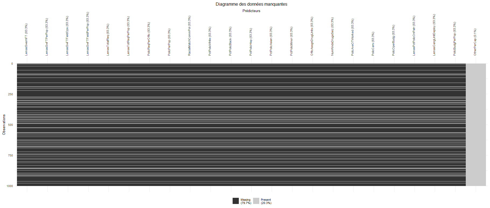
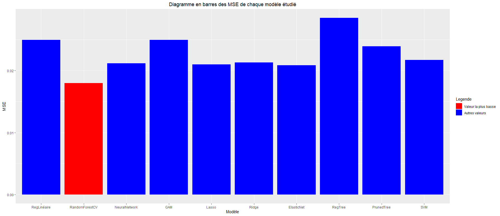

# Données Communities and Crime

## Analyse exploratoire

Le dataset "Communities and Crime" est un ensemble de données utilisé pour les problèmes de régression. Il contient 128 variables dont 123 sont prédictives et 1000 observations différentes (= 1000 communautés étudiées). Cet ensemble traite de données démographiques de communautés aux États-Unis et la variable à prédire est la variable ViolentCrimesPerPop qui définit le nombre de crimes violents pour 10 000 habitants. On a donc :

-   128 variables

-   122 prédicteurs

-   1 variable à prédire : ViolentCrimesPerPop

-   1000 observations

La 1ère chose qu'on choisit donc de faire est de retirer les variables non prédictives du jeu de données. Celles-ci sont triées et sont représentées par les 5 premières colonnes de la table.

Une fois qu'on a retiré les variables non prédictives, on peut noter plusieurs points. Tout d'abord toutes les variables sont des variables quantitatives normalisées, ce qui est une bonne chose car les données observées n'ont pas toutes la même échelle ou unité et avoir des données non normalisées aurait complexifié l'entraînement de modèles de prédiction.

La 2eme chose très importante à noter est l'existence de nombreuses données manquantes. En effet on voit que plusieurs variables contiennent des observations notées "Na" et c'est ce qui constitue le 1er défi de ce jeu de données.

## Données manquantes

Lorsqu'on est confrontés à des données manquantes pour un problème de prédiction, on a plusieurs choix :

-   On peut supprimer les prédicteurs ayant des observations manquantes.

-   On peut supprimer les observations ayant des données manquantes.

-   On peut imputer les données manquantes en utilisant la moyenne ou la médiane des autres données.

-   On peut imputer les données manquantes en les prédisant par rapport aux autres données avec différentes méthode de régression.

Dans notre cas, voici l'état de nos données manquantes :

Dans la figure ci-dessus, on voit les variables contenant des données manquantes (et uniquement celles-là) et chaque ligne noire représente une observation dont les données sont manquantes.

Si l'on exclut la variable OtherPerCap (dont il ne manque d'une donnée, à droite sur la figure), on voit que toutes les autres variables incomplètes ont 83.3% de données manquantes.

Cette proportion nous retire la possibilité d'imputer les données car les nouvelles données ne serait pas suffisamment représentatives (que ce soit en utilisant la moyenne, la médiane ou en essayant de les prédire).

On ne peut pas non plus décider d'ignorer les observations ayant des données manquantes car cela reviendrait à supprimer 83.3% des observations.

On choisit donc de retirer les prédicteurs affichés sur la figure ci-dessus, ce qui nous laisse 100 prédicteurs pour notre problème de régression.

## Modèles de prédiction

Pour entraîner nos différents modèles de régression, on choisit d'abord de séparer les données en un ensemble d'entraînement et de test. Ici, sur 1000 observations, on choisit 900 observations d'entraînement et 100 de test.

Ensuite, notre jeu de données comprenant 100 prédicteurs, on décide d'utiliser divers moyens pour trouver des modèles utilisant moins de prédicteurs, que ce soit avec cross-validation, nested cross-validation ou encore critère BIC. Pour la cross validation on utilise 10 plis, et une recherche backward, dû au grand nombre de prédicteurs.

Dans tous les cas, on trouve des modèles d'environ 50 prédicteurs, ce qui n'est pas nécessairement très performant mais compte tenu du type de données à prédire (nombre de crimes), le focus ne se fait pas nécessairement sur la performance mais plutôt la précision des modèles.

Au final, nous avons testé les modèles suivants :

-   Régression linéaire

-   Régression linéaire avec régularisation ridge

-   Régression linéaire avec régularisation lasso

-   Régression linéaire avec régularisation elastic net

-   Arbre de décision

-   Pruned Tree

-   Forêt Aléatoire 

-   GAM

-   Réseau de neurones

-   SVM

Voici les performances obtenues de chaque modèle :

On voit donc ci-dessus que notre meilleur modèle est celui obtenu avec forêt aléatoire, et qui utilise 50 prédicteurs. Ce n'est pas nécessairement le plus performant (notamment, le modèle avec régularisation lasso utilise moins de prédicteurs) mais compte tenu du contexte des données, on choisit de se donner plus d'importance à obtenir une erreur la plus faible possible.
